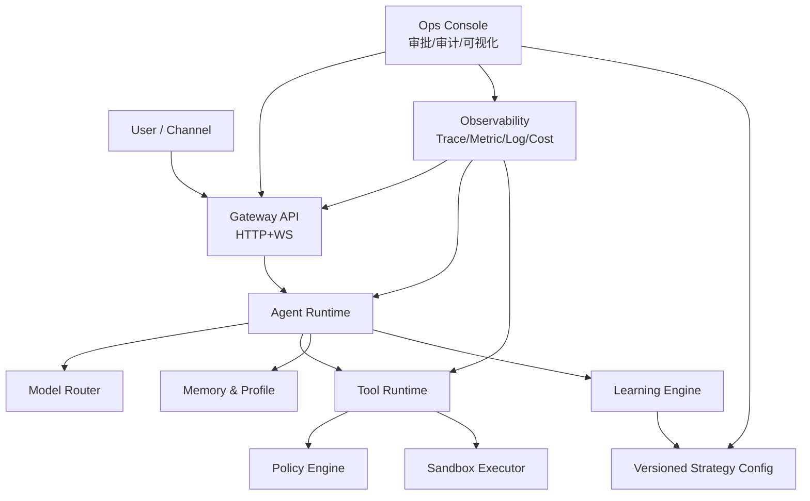

# AI Assistant 融合架构与外部方案调研（v1）

> 目标：在借鉴 OpenClaw 与 AIRI 的基础上，构建一个可插拔、易维护、可视化、可自进化且安全隔离的个人 AI Assistant。

调研快照时间：2026-03-04（America/Los_Angeles）

## 1. 融合策略（OpenClaw + AIRI）

### 1.1 继承 OpenClaw 的优势（系统骨架）

- `Gateway-first`：统一入口管理会话、渠道、工具调用、权限与审计。
- `Tool/Skill 生态`：将能力拆分为独立插件，按需安装与升级。
- `生产可运维性`：健康检查、诊断、重载、审计链路完整。
- `本地优先`：隐私和数据主权可控。

### 1.2 继承 AIRI 的优势（体验与前端架构）

- `Monorepo + Package 化`：多端能力与共享组件拆分清晰。
- `多形态 UI`：Web/Desktop/Mobile 可并行演进。
- `角色化体验`：Persona、语音、Avatar、实时互动组件成熟。
- `Provider 抽象`：便于多模型切换与试验。

### 1.3 融合原则

- 底层走 OpenClaw 风格控制平面，上层走 AIRI 风格体验平面。
- 学习能力只先改策略与配置，不直接改核心代码路径。
- 高风险能力默认隔离，所有可执行动作可审计、可回滚。

## 2. 目标架构（可插拔 + 可视化 + 可维护）

### 2.1 分层说明

- Interface Layer：Web/IM/移动端接入，统一会话体验。
- Gateway Layer：鉴权、限流、协议校验、路由、事件总线。
- Runtime Layer：任务拆解、执行编排、重试、恢复、中断继续。
- Capability Layer：工具运行时、MCP 工具桥接、插件生命周期。
- Memory/Learning Layer：偏好学习、习惯抽取、策略生成与验证。
- Security Layer：策略决策、审批流、隔离执行、审计追踪。
- Observability Layer：可视化监控、成本面板、策略效果对比。

## 3. 可插拔组件设计（核心）

### 3.1 统一插件契约

每个插件必须包含：

- `manifest.json`
  - `name`, `version`, `entry`, `capabilities`, `required_scopes`, `risk_level`
- `schema.ts` / `schema.json`
  - 输入输出 schema（请求前校验）
- `healthcheck()`
  - 组件自检
- `migrate()`
  - 升级时数据迁移钩子
- `rollback()`
  - 失败回退钩子

### 3.2 插件分类

- Tool Plugin：文件、浏览器、shell、第三方 API。
- Model Plugin：OpenAI/Anthropic/Ollama/vLLM 等路由适配。
- Memory Plugin：向量库、结构化记忆库、压缩器。
- Channel Plugin：Telegram/Discord/Webhook 等渠道连接器。
- UX Plugin：语音、Avatar、情感表达、主题组件。

### 3.3 生命周期

- `install -> verify(signature/schema) -> activate -> observe -> upgrade -> rollback/uninstall`

### 3.4 依赖解耦

- 核心服务只依赖接口（SPI），不依赖插件实现。
- 插件与核心之间只通过事件总线与契约接口通信。
- 禁止插件直接访问核心数据库表（走服务 API）。

## 4. 安全与隔离模型

### 4.1 权限模型

- `user scope`：用户级权限（谁可触发什么）。
- `session scope`：会话级权限（当前对话可用能力）。
- `tool scope`：工具级权限（命令、文件路径、网络域名）。

### 4.2 执行隔离级别

- `safe`：只读工具（搜索、读取、查询）。
- `guarded`：有副作用但可撤销（写文件、发消息）。
- `restricted`：系统级命令/外部执行，默认禁用 + 强审批。

### 4.3 强制控制

- 所有工具调用必须经过 `Policy Engine`。
- 高风险动作必须有 `Approval Ticket`（人审或预授权规则）。
- 审计日志不可变更（append-only），支持追溯与重放。

## 5. 自我成长与自我升级机制

## 5.1 成长闭环（有 token 即可持续优化）

1. 采集：会话轨迹、工具执行结果、用户反馈（脱敏）。
2. 归纳：抽取偏好规则、失败模式、任务模板。
3. 生成：产出“候选策略”与“候选提示词模板”。
4. 验证：离线回放 + 小流量 A/B。
5. 发布：策略配置版本升级（非代码热改）。
6. 监控：若质量/安全/成本异常，自动回滚。

### 5.2 自我升级边界

- 允许自动升级：提示词、路由策略、工具优先级、摘要策略。
- 半自动升级：插件小版本（通过签名校验 + 回归测试）。
- 禁止自动升级：核心执行器、安全策略引擎主逻辑。

### 5.3 升级门禁

- 质量门禁：任务成功率、用户纠正率、回复满意度。
- 成本门禁：单任务 token 上限、学习任务预算上限。
- 安全门禁：违规调用率、误触发高风险动作次数。

## 6. 可视化与运维界面

最少应提供 5 个看板：

- `Conversation`：会话状态、上下文长度、记忆命中率。
- `Execution`：任务 DAG、步骤耗时、失败重试链路。
- `Security`：审批记录、策略命中、拒绝原因分布。
- `Cost`：模型成本、工具成本、学习成本占比。
- `Learning`：新策略实验结果、A/B 指标、回滚记录。

## 7. 外部方案调研（用于高级功能）

## 7.1 编排与可恢复执行

- LangGraph：原生 checkpoint 与 durable execution，适合 agent 状态可恢复。
- Temporal：强一致的 durable workflow，适合长流程与故障恢复、版本演进。

建议：

- v1 用轻量 checkpoint（可先内建）。
- v2 若流程复杂度上升，接入 Temporal 或 LangGraph 持久化执行层。

## 7.2 工具与生态互操作

- MCP（Model Context Protocol）：标准化外部工具接入，降低 N x M 集成成本。

建议：

- 内部工具先走本地 SPI。
- 对外工具统一通过 MCP Bridge，减少自定义适配负担。

## 7.3 策略与授权

- OPA：通用策略决策引擎（Rego）。
- OpenFGA：关系型细粒度授权（Zanzibar 模型思路）。

建议：

- OPA 负责动作策略与风险判定。
- OpenFGA 负责“谁对什么资源有何权限”的授权关系查询。

## 7.4 观测与可视化

- OpenTelemetry：Trace/Metric/Log 三信号统一，便于跨组件关联。

建议：

- 所有执行链路注入 `trace_id`。
- 成本、审批、策略命中也作为结构化事件上报。

## 7.5 沙箱隔离

- gVisor：容器级额外隔离层，适合多租户与不可信代码。
- Firecracker：microVM 级隔离，安全边界更强，启动也较快。
- OpenHands 文档提示：本地 process 模式无隔离，仅适合受控环境。

建议：

- 开发环境可 process（便于调试）。
- 生产环境至少容器隔离，涉及高风险执行建议 microVM。

## 7.6 自我优化参考

- Reflexion：通过“语言反思”而非微调实现策略改进。
- Voyager：课程生成 + 技能库累积 + 迭代自检，适合长期成长。
- SWE-agent：可借鉴“任务评测基准 + 自动回归”方法来评估升级效果。

建议：

- 不做模型权重级自学习，优先做“策略级自进化”。
- 引入标准评测集，所有升级必须过离线回归。

## 8. 分阶段落地计划

### Phase 1（2-4 周）

- 网关、运行时、工具调用、审批、审计、可视化基础看板。
- 插件契约 v1 与插件加载器。

交付标准：

- 新增工具插件无需改核心代码。
- 高风险动作默认拦截并可审批。

### Phase 2（4-8 周）

- 记忆系统、用户偏好学习、策略配置版本化。
- A/B 实验 + 自动回滚。

交付标准：

- 偏好命中率提升；升级失败可自动回退。

### Phase 3（8 周+）

- MCP bridge、增强隔离（gVisor/Firecracker）、高级学习调度。
- 多端体验层增强（语音/Persona/Avatar）。

交付标准：

- 学习任务预算可控；主链路 SLA 不受影响。

## 9. 关键风险与规避

- 风险：自我升级导致行为漂移。
  - 规避：只升级策略配置；强制回放评测 + 灰度发布。
- 风险：插件质量参差导致系统不稳定。
  - 规避：签名校验、健康检查、熔断与自动卸载。
- 风险：工具权限失控。
  - 规避：默认拒绝、分级权限、审批票据、审计追踪。

## 10. 参考来源（调研链接）

- OpenClaw: https://tryopenclaw.site/
- OpenClaw Docs: https://openclawcn.com/en/docs/
- AIRI Repo: https://github.com/moeru-ai/airi
- MCP Spec: https://modelcontextprotocol.io/specification/2025-03-26/index
- LangGraph Durable Execution: https://docs.langchain.com/oss/javascript/langgraph/durable-execution
- Temporal Docs: https://docs.temporal.io/
- OpenTelemetry Docs: https://opentelemetry.io/docs/
- OPA Docs: https://www.openpolicyagent.org/docs/latest
- OpenFGA Docs: https://openfga.dev/docs/concepts
- gVisor Docs: https://gvisor.dev/docs
- Firecracker: https://firecracker-microvm.github.io/
- OpenHands Sandbox Notes: https://docs.openhands.dev/openhands/usage/sandboxes/process
- NVIDIA NeMo Guardrails: https://docs.nvidia.com/nemo-guardrails/index.html
- Reflexion (arXiv): https://arxiv.org/abs/2303.11366
- Voyager Project: https://voyager.minedojo.org/
- SWE-agent Repo: https://github.com/SWE-agent/SWE-agent

## 11. 选型矩阵（建议直接执行）

### 11.1 P0（现在就上，保证可用与可控）

- 网关：自研轻量 `Gateway`（借鉴 OpenClaw 的 typed WS + schema 校验）
- 执行编排：自研简化 `Orchestrator + checkpoint`（先不引入重量级编排框架）
- 插件协议：内部 `SPI + manifest + schema`（预留 MCP Bridge）
- 策略与审批：先内建策略引擎（后续可替换 OPA）
- 可观测：OpenTelemetry 埋点 + 基础面板
- 隔离：开发期容器隔离可选，生产默认容器隔离

### 11.2 P1（复杂度上升后接入）

- 跨生态工具：MCP Bridge（对接外部 MCP server）
- 细粒度授权：OpenFGA（对象级权限关系）
- 策略外置：OPA（策略代码化与独立发布）
- 学习门禁：A/B + 自动回滚 + 版本化策略发布

### 11.3 P2（高级能力）

- Durable execution 平台化：Temporal 或 LangGraph 持久执行层
- 高风险执行隔离：gVisor / Firecracker
- Guardrails 增强：NeMo Guardrails（输入输出与对话流约束）

### 11.4 决策规则

- 当流程跨天、需要人工中断恢复、失败重放复杂时：优先 Temporal。
- 当重点是 Agent 图编排与状态图开发效率时：优先 LangGraph。
- 当多租户高风险代码执行占比高时：优先 Firecracker。
- 当主要是容器运行时加固且成本敏感时：优先 gVisor。

---

结论：

- 架构上采用“OpenClaw 控制平面 + AIRI 体验平面”是主路径。
- 工程上采用“插件契约 + 策略引擎 + 可观测 + 隔离执行”保证可维护与安全。
- 成长上采用“策略级自进化 + 预算化学习 + 验证门禁 + 自动回滚”保证长期可控演进。

配套执行规范：

- `execution_control_plane_spec_v1.md`（并发任务、ETA、决策分级、checkpoint、升级不中断、自反思）
